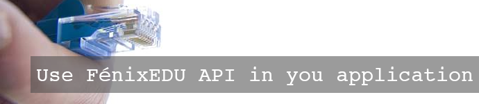

### Tutorials

[{.polaroid}
][Setup your development environment] 
This tutorial gets you started with a development environment that allows you to create applications
using our infrastructural code. After you follow the steps contained in this tutorial, you may go
further and start creating your own applications.

[{.polaroid}
][Create your own application] 
In this tutorial, you are guided in the initial steps to build an application and run it. After you
follow this tutorial, you will understand how applications integrate in our code infrastructure, and you
will have a running application.

[{.polaroid}
][Use FenixEDU API in your Application] 
In this tutorial, we explain how you can integrate our webservices within your application. After you followthis tutorial, you will known how to use our REST API and how you can improve your application using our data.

[{.polaroid}
][Design a new Theme] 
After following this tutorial, you will know how to create new themes to be used within our infrastructure.

[Setup your development environment]: /tutorials/setup-your-development-environment/
[Create your own application]: /tutorials/create-your-own-application/
[Create a Bankai application]: /tutorials/create-a-bankai-application/
[Use FenixEDU API in your Application]: /tutorials/use-fenixedu-api-in-your-application/
[Design a new Theme]: /tutorials/design-a-new-theme/